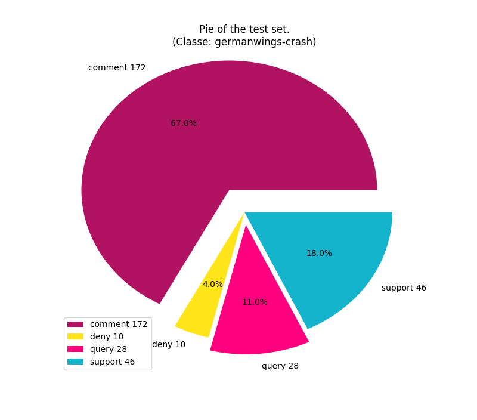

# Projet TALN
## Analyse des données
### Répartition des données

*figure 1* et *figure 2*:

On peut voir que l'ensemble d’entraînement et l'ensemble de test on a peu près la même distribution au niveau des "comment" (69% à 67%). Par contre il y a proportionnellement deux fois plus d'élément dans pour les "deny" du "train" que pour le "test".

Les sujets sont répartis de manière inéquitable entre le "test" et le "train". En effet il y a 7 sujets pour le "train" et 1 pour le "test" (germanwings-crash). On ne devra alors pas se baser sur le vocabulaire spécifique à chaque pour dissocier les catégories. On devra plutôt utiliser les relations que les mots entretiennent entre eux.

#### Train's Subjects:

La répartion des différentes catégories varient en fonction des sujets:

|subject|comment| deny  | query |support|
|:-----:|:-----:|:-----:|:-----:|:-----:|
|charliehebdo |  72%   |  6%  |  5%   |  17%   |
|ebola-essein|   66%   |   19%   |   3%   |   12%   |
|ferguson| 69%  |   9% |  10%   |   13%   |
|ottawashooting|  66%   |  10%   |  9%   |   15%   |
|prince-toronto|  68%   |  7%   |  12%   |   13%   |
|putinmissing|  60%   |  9%   |  9%   |   21%   |
|sydneysiege|  68%   |  8%   |  9%   |   14%   |

